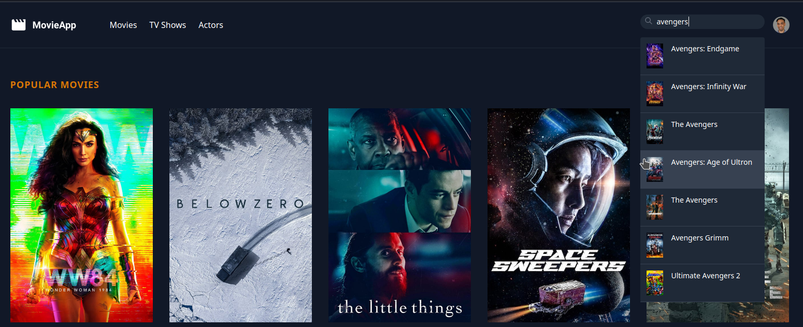
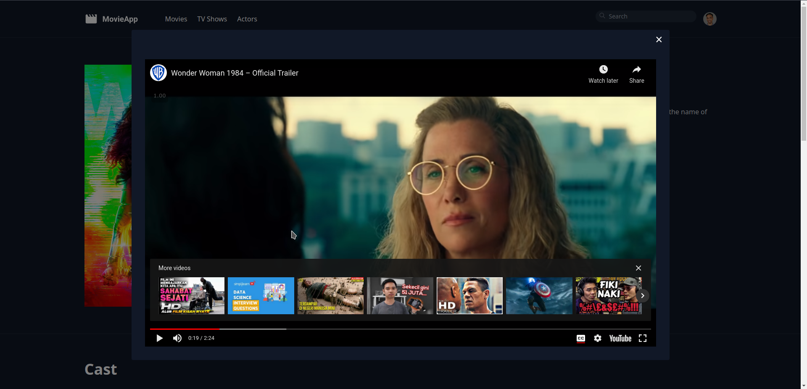

# Simple Movies App

This is an web app that i follow the tutorial on [youtube](https://www.youtube.com/watch?v=9OKbmMqsREc) to build it. Just like the name of this repository, I use 'laravel' for backend of the website and I also use 'alpine.js' for user interactivity such as keyboard interaction, mouse interaction, etc. 
For layouting and templating, I use default templating engine from laravel which is 'blade', and for some section of the website, i use 'laravel-livewire' to make the website doesn't always reload for minor changes and can re-render part of the website if there's a new data or new state.
And for the data, i use [The Movie DB](https://www.themoviedb.org/) API to get some data to use in this app.

## Notes
In the website, you will see TV Shows and Actors section on the navbar. I don't finish it, because i think those section are actually same with the Movies Section, the differences are just in the content.

## Preview

##### Home Page


##### Search Dropdown


##### Details Page of The Movie


##### Movie Trailer


## Installation

Download the zip of this repo or use git clone in your terminal.

```bash
git clone https://github.com/cyberroot294/laravel-movies-app
```

## Usage

```bash
cd laravel-movies-app

php artisan serve
```

After do the instructions, you will create a server which will normally run on port 8000. To open the website, type `http://localhost:8000` or whatever port you are using. And boom, you will be taken to the website. 

## Contributing
Pull requests are welcome. For major changes, please open an issue first to discuss what you would like to change.

Please make sure to update tests as appropriate.

## License
[MIT](https://choosealicense.com/licenses/mit/)
